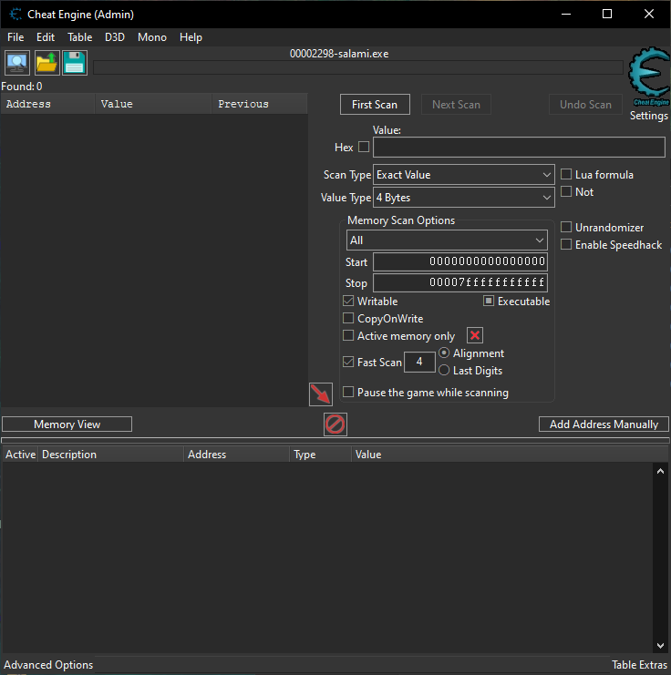
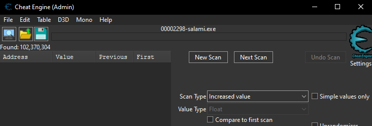
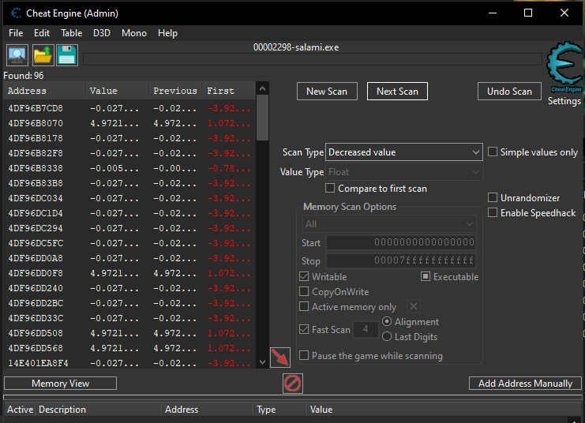
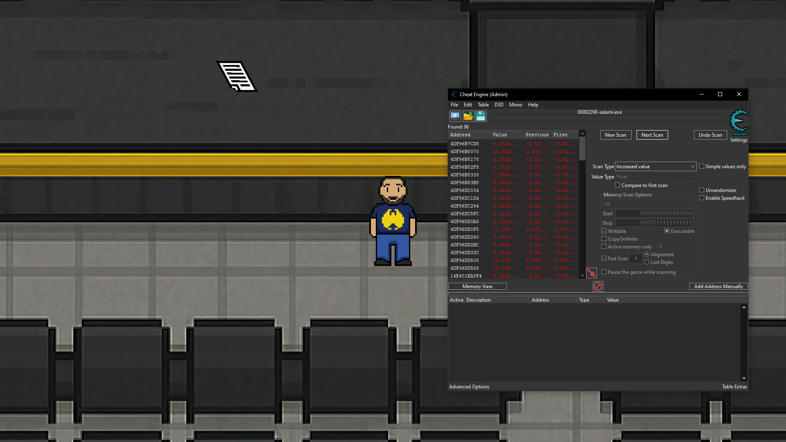
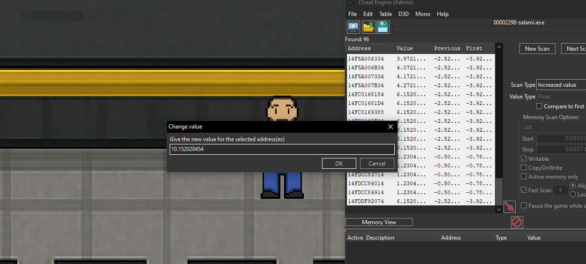
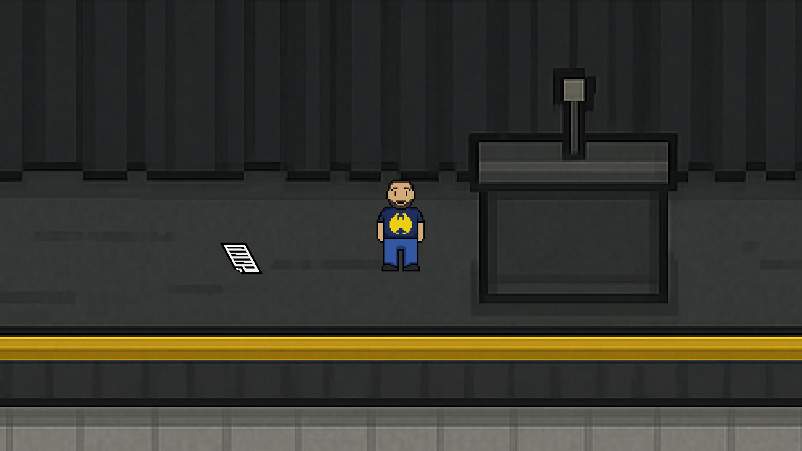

# Navaja Negra: The Game [PAL] (Spain) [MULTi10]

> Navaja Negra CTF 2025

> 02/10/2025 09:00 CEST - 04/10/2025 11:00 CEST

* Categoría: GamePWN
* Autor: nacabaro
* Dificultad: ★
* Etiquetas: Cheat Engine, Colliders

## Descripción
    
    Navaja Negra 2025: The Game

    Un juego que representa el caos y la dificultad de organizar un CTF y un evento al estilo de Navaja Negra.

    Tu misión es simple: recorre el escenario y encuentra todos los documentos perdidos para salvar el evento.

    _Creado con Unity por salamiproductions._
    
    Nota: Este juego contiene dos flags, introducid en este reto primera.

## Archivos
    
    build.7z

## Resolución

Al iniciar el juego podemos ver una hoja de papel sobre el escenario. Esta se corresponde con la primera flag. El objetivo es subir al escenario e interactuar con el objeto de la hoja.

### Manipulando la posición del jugador

Para resolver este reto, se debe manipular la posición del jugador usando Cheat Engine. Primero iniciamos el juego y conectamos Cheat Engine al proceso.

Unity utiliza el valor tipo `float` como unidad para manipular la posición del jugador. Por tanto, escaneamos por valores de este tipo en el proceso, buscando `Unknown initial value`. 

A continuación, una vez escaneado, vamos a mover el personaje un poco hacia arriba. Ahora, en Cheat Engine vamos a escanear por valores incrementados, pulsando en "Next Scan".

Llegará el punto en el que habrán entre 900 y 1200 valores en memoria. Ahora vamos a mover a Rubén hacia abajo y vamos a escanear de nuevo, esta vez especificando un "Decreased value". Esto reducirá la lista a 96 valores.

Finalmente, vamos a mover a Rubén cerca del escenario, y vamos a modificar todos los valores por un valor mayor, el cual nos permitirá saltar encima del escenario.

> **flag: nnctf{3nC0ntr4St3_lA_eSc4L3r444!!!__Gr4NdeEE33}**