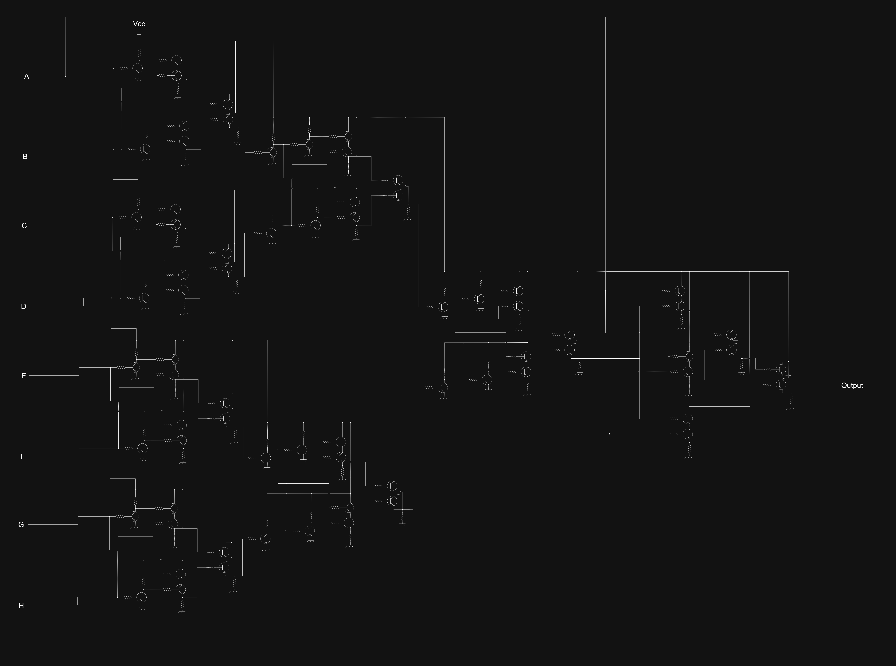

# Convocatoria Extraordinaria

> Navaja Negra CTF 2025

> 02/10/2025 09:00 CEST - 04/10/2025 11:00 CEST

* Categoría: Hardware/RF
* Autor: kesero
* Dificultad: ★★
* Etiquetas: Puertas lógicas, Función de paridad, Función de mayoría

## Descripción
    
    Mientras seguíamos desempolvando cajas del desván, encontramos un sobre arrugado con un título en letras rojas:
    "Ejercicio de Admisión – Convocatoria Extraordinaria 2002”.

    Dentro había un diagrama extraño: un circuito hecho con transistores, cables y ocho entradas, como si formara un auténtico laberinto electrónico. Al final del esquema, una única salida.
    Me contó que cuando era joven, este circuito se usaba como ejercicio base para superar la asignatura de "Fundamentos y Estructura de Computadores". Según él, resolverlo era casi un hito de superación, ya que conseguías superar una de las peores asignaturas de la carrera.
    Como mi tío sabe que tengo el título de ingeniero informático recién sacado, me dijo:

    "¿Te atreves con esto? A mí me costó 3 convocatorias..."

    Junto al esquema, venía una hoja de estímulos con varias combinaciones de entrada.
    Sinceramente, necesito ayuda...

## Archivos
    
    laberinto.png



    inputs.csv

```
A,B,C,D,E,F,G,H
0,1,1,1,1,1,1,0
0,0,0,1,0,0,1,1
1,1,0,1,1,1,1,0
0,0,0,1,1,1,0,0
0,1,0,1,1,1,1,0
0,1,1,0,0,0,1,0
1,0,1,1,0,1,0,1

...
```

## Resolución

Este esquemático está compuesto por transistores, organizados en ciertos conjuntos que forman las puertas lógicas `AND`, `OR` y `NOT`, representando así la lógica combinacional del esquemático.

Para resolver el reto, será necesario traducir progresivamente los transistores en puertas lógicas, simplificar el circuito y finalmente, emular su funcionamiento para obtener la salida.

### Traspaso de transistores a puertas lógicas

Para trasladar los transistores a su configuración de puerta lógica correspondiente, nos guiaremos con el siguiente [recurso web](https://www.101computing.net/creating-logic-gates-using-transistors/).

Allí encontraremos la información necesaria para identificar y traducir cada componente a su equivalente lógico:


Teniendo en cuenta lo anterior, el circuito lógico resultante sería el siguiente:


### Simplificación del circuito

Si nos fijamos, a la izquierda contamos con 7 bloques bien definidos con la siguiente lógica combinacional:

$$ \text{XOR}(A,B) = (A \land \lnot B) \lor (\lnot A \land B) $$

Esta expresión lógica corresponde con una representación de la puerta lógica `XOR` como suma de productos. Teniendo esto en mente, el circuito se puede simplificar aún más:


Una vez reducido el número de puertas lógicas, podemos emular el comportamiento del circuito en `Python`. Sin embargo, aún es posible simplificarlo más.

A raíz de esta última simplificación, podemos observar dos partes bien definidas en el circuito. La sección de la izquierda se corresponde con 7 puertas `XOR` encadenadas con las 8 entradas, mientras que la parte de la derecha toma como entradas la salida del circuito `XOR` junto a la entrada de `A` y de `H` para generar la salida final.

1. Si nos centramos en la sección de la izquierda, esta parte del circuito se puede simplificar teniendo en cuenta que representa una `función de paridad par` de los bits entrantes.

    Es decir, si la entrada del circuito es `10110101` la salida será `1`, ya que dicha entrada cuenta con un número impar de bits a `1`. En cambio si la entrada del circuito cuenta con una cantidad par de bits a `1`, la salida de esa parte del circuito será `0`.

2. La parte de la derecha cuenta con la siguiente expresión lógica:

$$
M(A,B,C) = (A \cdot B) + (A \cdot C) + (B \cdot C)
$$

Esta lógica corresponde a una `función de mayoría` de 3 entradas, `A`, `H`, y la salida de la `función de paridad`.
Una `función de mayoría` es una función lógica que devuelve `1` si al menos dos de sus entradas son `1`, y `0` en caso contrario.

Por lo tanto, si dos o más entradas tienen el valor de `1`, la salida final será `1`.


El script en python que emula el comportamiento representado en ambas funciones es el siguiente:

```python
import csv

def parity(bits):
    return sum(bits) % 2

def majority3(a, b, c):
    return 1 if (a + b + c) >= 2 else 0

def binary_to_text(binario):
    chars = [chr(int(binario[i:i+8], 2)) for i in range(0, len(binario), 8)]
    return ''.join(chars)

def main():
    filename = "entradas.csv"
    bin_result = ""

    with open(filename, newline='') as csvfile:
        reader = csv.DictReader(csvfile)
        for row in reader:

            A = int(row['A'])
            B = int(row['B'])
            C = int(row['C'])
            D = int(row['D'])
            E = int(row['E'])
            F = int(row['F'])
            G = int(row['G'])
            H = int(row['H'])

            bits = [A, B, C, D, E, F, G, H]
            p = parity(bits)
            salida = majority3(A, H, p)
            bin_result += str(salida)

    print(f"\n[!] Binario en bruto: {bin_result}")
    print(f"\n[!] Mensaje final: {binary_to_text(bin_result)}")

if __name__ == "__main__":
    main()
```

Por el contrario, el script no simplificado que emula la lógica combinacional descrita es el siguiente:

```python
import pandas as pd

def calculate_F(A, B, C, D, E, F, G, H):
    xor_all = A ^ B ^ C ^ D ^ E ^ F ^ G ^ H
    output = ((xor_all & H) | (A & H)) | (A & xor_all)
    return output

def binary_to_text(binario):
    chars = [chr(int(binario[i:i+8], 2)) for i in range(0, len(binario), 8)]
    return ''.join(chars)

def main():
    df = pd.read_csv("inputs.csv")

    bits = ""
    for _, row in df.iterrows():
        A, B, C, D, E, F, G, H = [int(x) for x in row]
        output = calculate_F(A, B, C, D, E, F, G, H)
        bits += str(output)

    print(f"\n[!] Binario en bruto: {bits}")

    flag = binary_to_text(bits)
    print(f"\n[!] Mensaje final: {flag}")

if __name__ == "__main__":
    main()
```

```
❯ python script.py

[!] Mensaje final: Beep, beeep, beeeeeeep ¡Enhorabuena! Has demostrado ser capaz de aprobar la asignatura de "Fundamentos y Estructura de Computadores". Espero que al menos hayas repasado qué son y cómo funcionan las puertas lógicas, la paridad de bits y la importancia de las funciones de mayoría. Has pasado la prueba, la flag es tuya nnctf{D3s3mp0lv4ndo_aPunt3s_M1l3nAr10s!!!} beeeeeeep, beeep, beep.
```

> **flag: nnctf{D3s3mp0lv4ndo_aPunt3s_M1l3nAr10s!!!}**