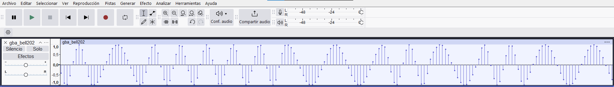
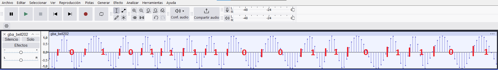
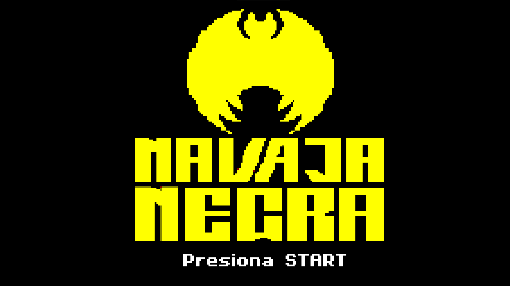
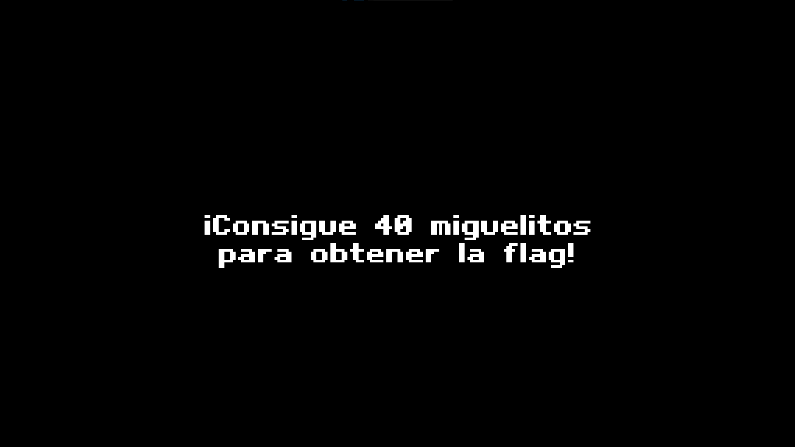
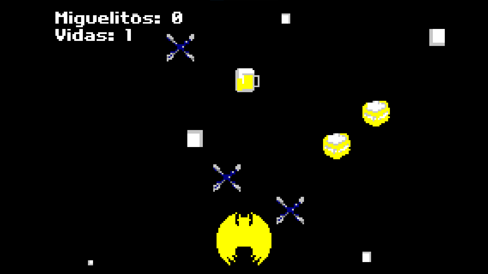
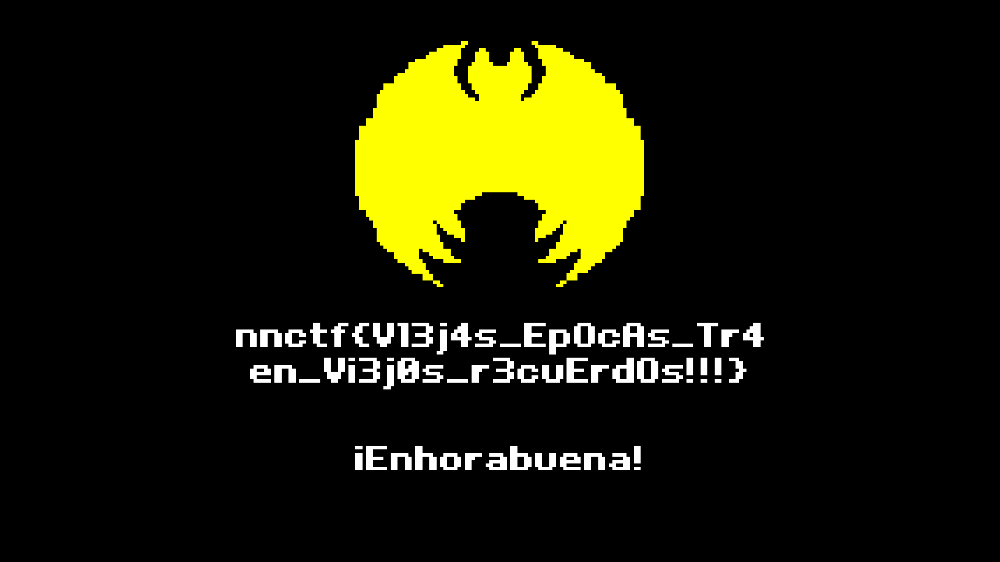

# Retro Advance

> Navaja Negra CTF 2025

> 02/10/2025 09:00 CEST - 04/10/2025 11:00 CEST

* Categoría: Hardware/RF
* Autor: kesero
* Dificultad: ★
* Etiquetas: GBA ROM, FSK Bell 202

## Descripción
    
    El pasado fin de semana estuve con mi tío revisando algunos de sus viejos recuerdos. Entre anécdotas y risas, me contó algo que me dejó sin palabras. En su época, algunos videojuegos se distribuían por radio o venían escondidos en paquetes de cereales. Pensé que me estaba tomando el pelo, hasta que me enseñó un par de antiguos casetes que tenía guardados.

    Resulta que mi tío había capturado una transmisión hace años: una ROM de Game Boy Advance emitida por la radio. Nunca supo cómo decodificarla, pero guardó la grabación "por si acaso".

    Como sabe que me interesan estas cosas, me la pasó y me dijo: "A ver si tú puedes hacer algo con esto."
    La verdad... yo no tengo ni idea de por dónde empezar.

    ¿Te animas a echarme una mano y ver si hay algo jugable en esa señal?

## Archivos
    
    sound.wav

## Resolución

### Decodificación de la señal

Si abrimos el `sound.wav` en programas de audio como `Audacity` encontramos lo siguiente:



Este tipo de señal tan característica de dos frecuencias bien definidas, corresponde a una codificación por FSK en la que cada periodo transmite un bit de información.

Siguiendo la historia del enunciado, antiguamente había canales de radio que transmitían videojuegos (ZX Spectrum, Commodore 64, etc.) en formato de audio, en el que los oyentes grababan en cinta. En aquella época, uno de los esquemas más conocidos y utilizados fue el estándar `Bell 202`, que transmitía `1200 baudios` con frecuencias de `1200 Hz` que simbolizaban el bit `1` y frecuencias de `2200 Hz` que representaban el bit `0`.

Siguiendo la analogía histórica, el archivo proporcionado `sound.wav` se corresponde con una señal FSK codificada siguiendo el estándar `Bell 202` descrito anteriormente.

Teniendo esta información en cuenta, podemos interpretar la señal en `Audacity` de la siguiente manera:



Para completar la decodificación del audio, podemos utilizar scripts automatizados en Python o directamente emplear la herramienta `minimodem`, la cual nos permitirá convertir entre datos digitales y señales de audio moduladas.

Para instalarlo utilizamos:

```
[~]─$ sudo apt install minimodem
```

Decodificamos la señal de la siguiente manera:

```
[~]─$ minimodem --rx 1200 --mark 1200 --space 2200 -f sound.wav > recovered

    ### CARRIER 1200 @ 1200.0 Hz ###

    ### NOCARRIER ndata=1188828 confidence=4.575 ampl=1.000 bps=1200.00 (rate perfect) ###
```

Para asegurarnos de que la decodificación fue exitosa, comprobamos sus metadatos:

```
[~]─$ file recovered

    recovered: Game Boy Advance ROM image: "MIGUELITOS" (SBTP01, Rev.00)
```

### Abrir la ROM

Una vez contamos con la ROM original del videojuego, utilizaremos el emulador gratuito [mgba](https://mgba.io/) para cargar juegos de Gameboy Advance. Al cargar la ROM, nos daremos cuenta de que el videojuego se basa en un "Catch game" en el que para obtener la flag, tendremos que capturar 40 Miguelitos sin ser abatidos en el intento, esquivando los cuchillos y tomando jarras de cerveza para obtener vidas extra.






> **flag: nnctf{V13j4s_EpOcAs_Tr4en_Vi3j0s_r3cuErdOs!!!}**