# Navaja Negra: The Game [PAL] (Spain) [MULTi10]

> Navaja Negra CTF 2025

> 02/10/2025 09:00 CEST - 04/10/2025 11:00 CEST

* Categoría: GamePWN
* Autor: nacabaro
* Dificultad: ★★☆
* Etiquetas: Il2Cpp, Ghidra, Reversing

## Descripción
    
    Navaja Negra 2025: The Game

    Un juego que representa el caos y la dificultad de organizar un CTF y un evento al estilo de Navaja Negra.

    Tu misión es simple: recorre el escenario y encuentra todos los documentos perdidos para salvar el evento.

    _Creado con Unity por salamiproductions._

    Nota: Este juego contiene dos flags, introducid en este reto segunda.

## Archivos
    
    build.7z

## Resolución

Para la parte 2 hacen falta herramientas de reversing. Para ello vamos a usar Ghidra, Il2Cpp dumper y UABE.

### Extracción de metadatos y dummy DLLs

Vamos a necesitar los archivos `GameAssembly.dll` y `global-metadata.dat`. Se necesitará usar [esta aplicación](https://github.com/Perfare/Il2CppDumper).

Una vez descargada, basta con ejecutarla e indicarle los dos ficheros del juego. Esto generará los Dummy DLLs, que nos permiten explorar de manera básica la estructura del proyecto del juego. También podemos observar unos archivos extra: uno que contiene strings y otro que contiene datos sobre el código.

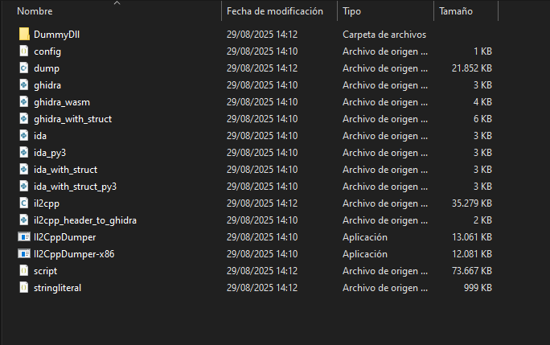

### Importación en Ghidra

Para el siguiente paso, se puede utilizar Ida o Ghidra, gracias a que Il2Cpp incluye scripts para ambas plataformas. Estos scripts nos permiten aplicar la información obtenida de los metadatos del juego sobre el código, habilitándonos ver clases, nombres de funciones y código más legible.

En Ghidra, hacemos uso del Script Manager y creamos un nuevo script añadiendo el código del archivo `ghidra_with_structs.py`, que se puede obtener en la carpeta de Il2CppDumper. Una vez añadido y ejecutado, nos solicitará que seleccionemos el archivo `script.json`, que está ubicado en la carpeta de Il2CppDumper, y que se creará después de ejecutar el programa.

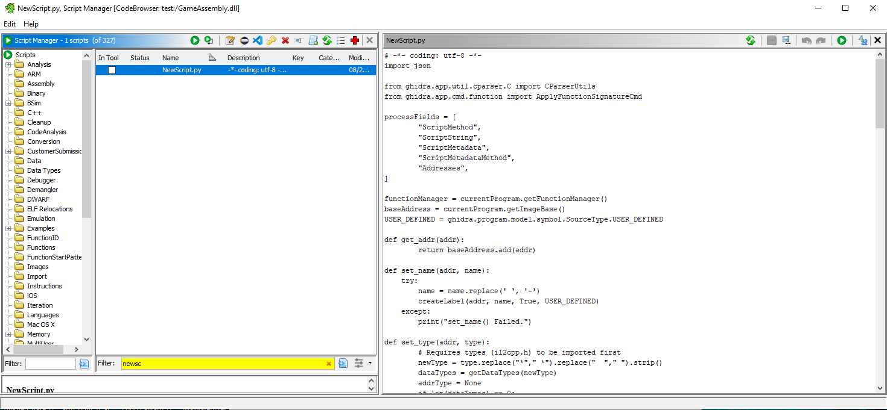

Dejamos algo de tiempo para que Ghidra cargue los datos y podremos observar las funciones del código.

### Entendiendo la clase FlagDecrypt

Una vez añadidos los datos, podemos ver una función llamada `DecryptFlag`. Viendo el contenido de esta función, descubrimos que se trata de un cifrado AES-CBC de 256 bits, con tamaño de bloque de 128 bits.

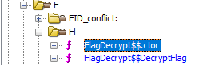

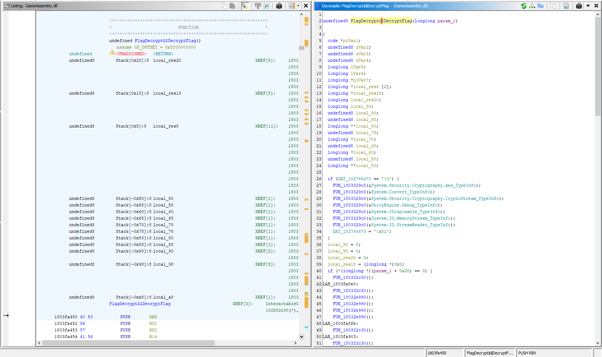

Esta clase no contiene la clave y el vector inicializador, ya que se añaden de manera externa.

Para obtener las claves hay que observar las llamadas a esta función:

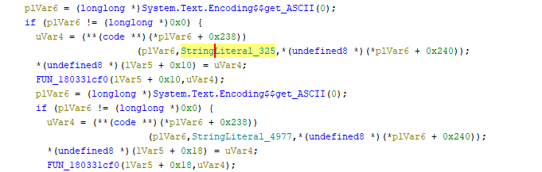

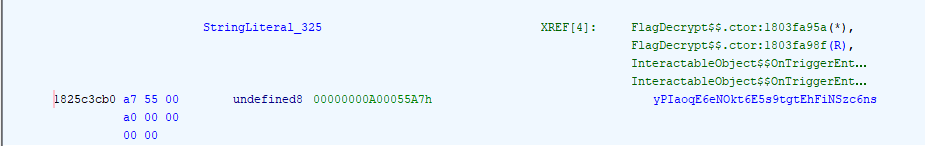

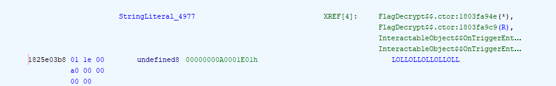

### Obteniendo el texto a desencriptar

La clase carga de un `TextAsset` la flag encriptada. Para obtener este dato, necesitaremos alguna herramienta para poder ver los assets, como [AssetRipper](https://github.com/AssetRipper/AssetRipper).

Mirando el código decompilado en Ghidra, podemos ver que junto a la clave y el vector, está cargando un `TextAsset` llamado `Enc`. Cargamos el archivo `resources.assets` con AssetRipper y buscamos `Enc`.

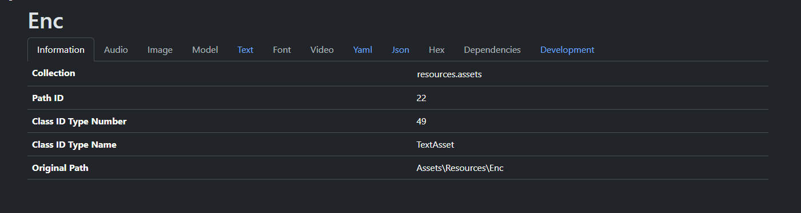

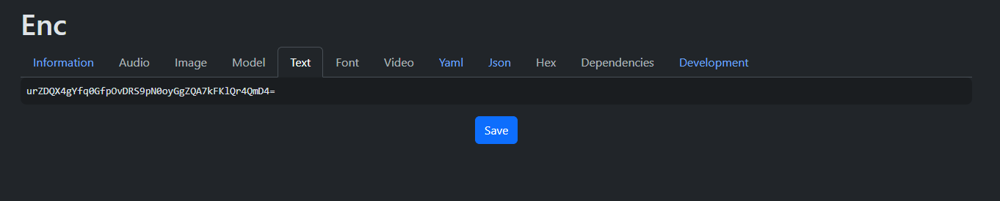

#### Forma alternativa de obtener este dato

Mirando en los logs del juego, que se guardan en AppData, podemos encontrarnos con el mismo dato impreso en la carpeta `AppData\LocalLow\DefaultCompany\salami`.

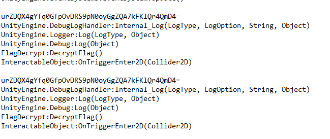

### Desencripción de la flag

Desencriptamos y...

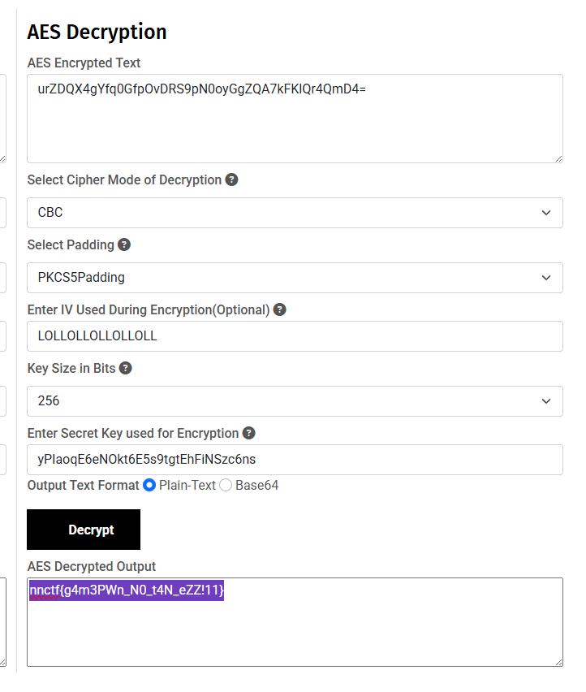

> **flag: nnctf{g4m3PWn_N0_t4N_eZZ!11}**