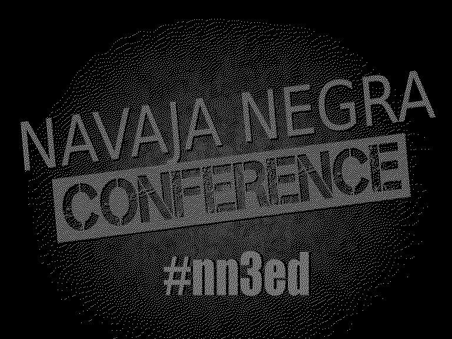
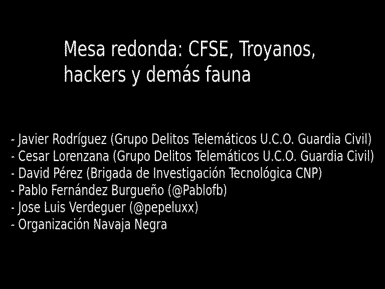
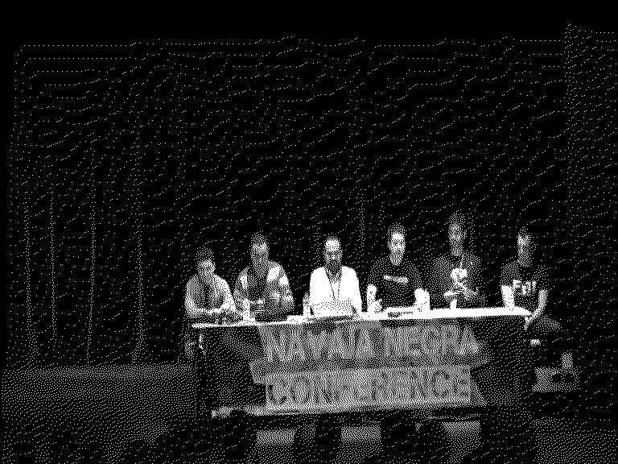
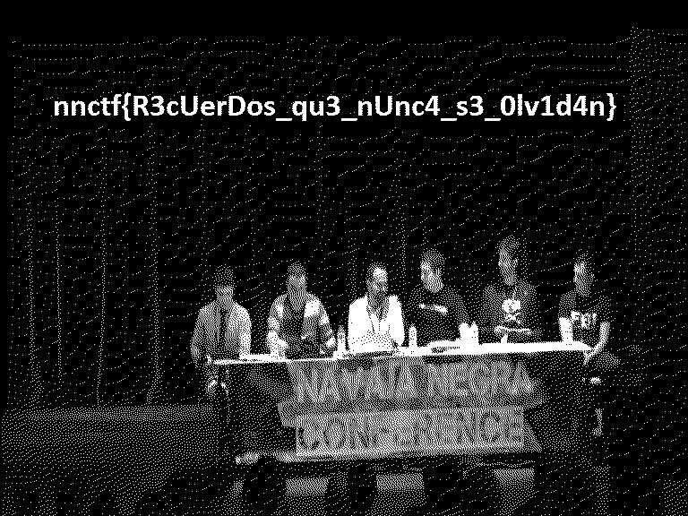

# PAL de Recuerdos

> Navaja Negra CTF 2025

> 02/10/2025 09:00 CEST - 04/10/2025 11:00 CEST

* Categoría: Hardware/RF
* Autor: kesero
* Dificultad: ★★★
* Etiquetas: Señal PAL

## Descripción
    
    Entre las cosas que rescatamos el pasado fin de semana mi tío y yo, encontramos una caja llena de cintas, disquetes y papeles de su adolescencia. Rebuscando entre ellos, apareció una grabación con una etiqueta escrita a rotulador que decía:
    "Navaja Negra 2013 – PAL".

    Me miró con una mezcla de nostalgia y me dijo:

    "Esto es de una charla que emitieron hace años... Dicen que tenía un mensaje oculto, algo que solo unos pocos lograron ver. Yo lo intenté, pero nunca supe cómo hacerlo.
    Tú, con tus cacharros... ¿crees que podrías echarle un vistazo?”

    La señal parecía proceder de una antigua transmisión de vídeo en blanco y negro, con una resolución de 768 píxeles por línea y 576i, siguiendo el estándar PAL.
    Gracias a mis herramientas y algo de paciencia, logré digitalizarla y guardarla como un archivo .vcd, donde pude aislar la señal de sincronización de la carga útil.

    Mi tío, sin embargo, sigue convencido de que hay algo importante ahí dentro. Lo noto en sus ojos cada vez que lo recuerda.

    Yo... ya no sé si es solo nostalgia, o si realmente hay algo escondido que merece ser visto.

## Archivos
    
    video_capture.vcd

```vcd
$timescale 1ns $end
$scope module logic $end
$var wire 1 ! D0 $end
$var wire 1 " D1 $end
$upscope $end
$enddefinitions $end
#0
0!
0"
#0
1!
#4000
0!
#4000
0"
#196000
1!
#200000
0!
#200000
0"
(...)
```

## Resolución

El archivo `video_capture.vcd` contiene una captura digitalizada de una señal de vídeo analógica `PAL` (768x576i, 50 Hz) que debemos de transformar en contenido visual.

El sistema `PAL` utiliza un esquema entrelazado: primero se transmiten las líneas impares y luego las pares, mostrando 50 "medios fotogramas” por segundo. Dos de estos medios fotogramas forman un cuadro completo, lo que resulta en 25 cuadros por segundo.


### Análisis de video_capture.vcd

El archivo `video_capture.vcd` contiene eventos digitales en formato `VCD` (Value Change Dump), que se pueden interpretar como una señal digitalizada de un vídeo compuesto. Del archivo podemos extraer la siguiente información:

- `D0 (!)` contiene la información referente a la sincronización vertical/horizontal.
- `D1 (")` contiene los datos de luminancia de los píxeles. Los cambios de `D1` representan los niveles de gris de cada píxel.
- Los timestamps de la captura se expresan en nanosegundos.
- Los pulsos de sincronización `(!)` indican el inicio de una línea de vídeo o de un nuevo frame.
- Cada bit de la señal de sincronización (sync_pulse_duration) dura 4000 ns.

### Decodificación

Para decodificar la señal y reconstruir los frames pertenecientes al vídeo codificado en `video_capture.vcd`, primero se realiza una lectura línea por línea, extrayendo el valor de `timestamp` y las señales `D0` y `D1` junto con sus valores correspondientes.

Posteriormente, tenemos que expresar una lógica de `detección de sincronización`. Cuando `D0` toma el valor `1`, se interpreta como el inicio de una línea de vídeo. Además, tenemos que establecer un umbral de tiempo para asumir el comienzo de un nuevo frame.

Por último, tenemos que `decodificar la información extraída` en cada frame basándonos en los pulsos de sincronización, reconstruyendo las líneas de vídeo en arrays de píxeles con su correspondiente escala de grises. Al agrupar estas líneas se obtienen los frames completos y por último los guardaremos como imagen.

El script que realiza el proceso descrito es el siguiente:

```python
import numpy as np
from PIL import Image
import os

def read_vcd(filename):
    """Lee el archivo VCD y devuelve una lista de eventos (timestamp, signal, value)."""
    events = []
    timestamp = 0
    with open(filename) as f:
        for line in f:
            line = line.strip()
            if line.startswith("#"):
                timestamp = int(line[1:])
            elif line.startswith(("0", "1")):
                value = int(line[0])
                signal = line[1]
                events.append((timestamp, signal, value))
    return events

def extract_line(events, start_idx, pixels_per_line, bit_duration):
    """Extrae los bits de una línea de vídeo a partir del índice de inicio."""
    line_start_time = events[start_idx][0]
    line_bits = np.zeros(pixels_per_line, dtype=np.uint8)

    # Valor inicial de D1
    current_value = 0
    j = start_idx - 1
    while j >= 0:
        if events[j][1] == '"':
            current_value = events[j][2]
            break
        j -= 1

    # Cambios futuros de D1
    next_changes = [(t, v) for t, s, v in events[start_idx:] if s == '"']
    next_idx = 0

    for p in range(pixels_per_line):
        sample_time = line_start_time + p * bit_duration
        while next_idx < len(next_changes) and next_changes[next_idx][0] <= sample_time:
            current_value = next_changes[next_idx][1]
            next_idx += 1
        line_bits[p] = current_value

    return line_bits

def decode_frames(events, pixels_per_line, active_lines, bit_duration, frame_duration_threshold):
    """Decodifica todos los frames de la lista eventos."""
    frames = []
    current_frame_lines = []
    last_sync_time = 0
    i = 0
    frame_count = 0

    while i < len(events):

        # Buscar el inicio de sincronización
        while i < len(events) and not (events[i][1] == "!" and events[i][2] == 1):
            i += 1
        if i >= len(events):
            break
        sync_start = events[i][0]

        # Nuevo frame si ha pasado suficiente tiempo
        if sync_start - last_sync_time > frame_duration_threshold and current_frame_lines:
            frame_array = np.array(current_frame_lines[:active_lines], dtype=np.uint8) * 255
            frames.append(Image.fromarray(frame_array, mode="L"))
            current_frame_lines = []
            frame_count += 1
            print(f"[+] Frame {frame_count} recuperado")

        last_sync_time = sync_start
        i += 1

        # Esperar fin del pulso de sincronización
        while i < len(events) and not (events[i][1] == "!" and events[i][2] == 0):
            i += 1
        if i >= len(events):
            break

        # Extraer línea de video
        line_bits = extract_line(events, i, pixels_per_line, bit_duration)
        current_frame_lines.append(line_bits)
        i += 1

    # Guardar último frame
    if current_frame_lines:
        frame_array = np.array(current_frame_lines[:active_lines], dtype=np.uint8) * 255
        frames.append(Image.fromarray(frame_array, mode="L"))
        frame_count += 1
        print(f"[+] Frame {frame_count} recuperado")

    return frames

def save_frames(frames, folder="frames", prefix="frame"):
    """Guarda los frames como imágenes en formato png"""
    os.makedirs(folder, exist_ok=True)
    
    for i, frame in enumerate(frames):
        filename = os.path.join(folder, f"{prefix}_{i:04d}.png")
        frame.save(filename)
    
    print(f"\n[!] Guardados {len(frames)} frames en '{folder}/'")

def main():

        # Configuración
        pixels_per_line = 768
        active_lines = 576
        bit_duration = 250  # ns
        sync_pulse_duration = 4000  # ns
        frame_duration_threshold = 1_000_000  # ns

        events = read_vcd("video_capture.vcd")
        frames = decode_frames(events, pixels_per_line, active_lines, bit_duration, frame_duration_threshold)
        if frames:
            save_frames(frames)
        else:
            print("No se detectaron frames.")

if __name__ == "__main__":
    main()
```

```
[~]─$ python decoder.py

[+] Frame 1 recuperado
[+] Frame 2 recuperado
[+] Frame 3 recuperado
[+] Frame 4 recuperado
[+] Frame 5 recuperado
[+] Frame 6 recuperado
[+] Frame 7 recuperado
[+] Frame 8 recuperado
[+] Frame 9 recuperado
[+] Frame 10 recuperado
[+] Frame 11 recuperado
[+] Frame 12 recuperado
[+] Frame 13 recuperado
[+] Frame 14 recuperado
[+] Frame 15 recuperado
[+] Frame 16 recuperado

[!] Guardados 17 frames en la carpeta frames
```

Los frames más relevantes de la decodificación anterior son los siguientes:









> **flag: nnctf{R3cUerDos_qu3_nUnc4_s3_0lv1d4n}**