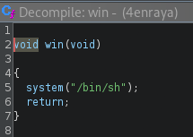

# 4_en_raya 

> Navaja Negra CTF 2025

> 02/10/2025 09:00 CEST - 04/10/2025 11:00 CEST

* Categoría: Pwn
* Autor: M0nk3st 
* Dificultad: ★☆
* Etiquetas: OOBW

## Descripción

    ¡Bienvenido al clásico juego de 4 en raya!

    Tu objetivo es sencillo: coloca tus fichas y consigue alinear cuatro en horizontal, vertical o diagonal antes que tu oponente.

## Archivos

    4enraya

```
Binario ELF
```

## Resolución

Al abrir el binario con la herramienta Ghidra, podemos observar el conjunto de funciones que lo componen. Entre ellas destaca una función denominada `win`, cuya finalidad es abrir una shell. Dado que este comportamiento nos proporciona la capacidad de ejecutar comandos arbitrarios en el sistema, win se convierte en nuestra función objetivo a la que debemos redirigir el flujo de ejecución.



Además encontramos una extraña implementación del juego del 4 en raya:

![[images/2.png]]

La función `play_turn` contiene una lógica defectuosa en el manejo de la variable `local_10`. Cuando la parte superior de una columna ya está ocupada, el programa intenta buscar un espacio libre desplazándose hacia abajo, pero lo hace de forma incorrecta:

![[images/3.png]]

Aquí `local_10` comienza en 0 y se decrementa mientras la columna esté ocupada. El problema es que nunca se valida que su valor se mantenga dentro de los límites de la matriz `board[8][8]`. Como resultado, `local_10` puede tomar valores negativos.

Más adelante, esta variable se utiliza como índice de escritura:

![[images/4.png]]

Si `local_10` es negativo, estamos escribiendo fuera de los límites del vector, lo que constituye un Out of Bounds Write (OOBW). Esto nos da la capacidad de sobrescribir memoria adyacente al tablero. 

![[images/5.png]]

Forzando esta condición, el programa termina generando un `sigabort`, señal que evidencia un acceso indebido a memoria. Este error, sumado al mensaje de `stack smashing detected`, nos indica que se está sobrescribiendo una sección crítica del binario, la Global Offset Table (GOT). En concreto, las direcciones de funciones como `exit`, `setvbuf` y `getchar` quedan expuestas a ser modificadas. El fallo se manifiesta precisamente al corromper la entrada de `getchar`, lo que provoca el comportamiento anómalo observado.

![[images/6.png]]

Al inspeccionar la Global Offset Table (GOT) observamos un detalle crucial: la dirección asociada a `exit` es `0x4030a0`, mientras que la de `win` es `0x40334d`. La similitud entre ambas es evidente, ya que únicamente difieren en los dos últimos bytes. Esta característica simplifica el proceso de explotación, pues no es necesario modificar la dirección completa, sino únicamente esos bytes finales para redirigir la llamada a `exit` hacia `win`.

Gracias a la vulnerabilidad de Out of Bounds Write, podemos alterar la dirección de `exit` en la GOT. 
Para ello, seleccionamos como símbolos de los jugadores valores ASCII específicos que nos permitan sobrescribir esos bytes de forma controlada.

Una vez reemplazada la dirección, basta con provocar una llamada a `exit()` por ejemplo, introduciendo la opción e durante la partida. En ese momento, en lugar de finalizar la ejecución, el programa redirige el flujo hacia `win`, otorgándonos una shell desde la cual es posible acceder a flag.txt.

Viendo la tabla ASCII nos damos cuenta que si el símbolo del player 1 es un "3" y el del player 2 es un "]" seremos capaces de convertir la dirección de `exit` en la de `win`.

Con los caracteres necesarios determinados, el siguiente paso consiste en calcular el offset exacto. Para ello, forzamos nuevamente un `sigabort`. Como nuestro objetivo es modificar la de `exit`, y esta se encuentra dos posiciones antes en dicha tabla, basta con ajustar el cálculo restando esa diferencia.

De este modo obtenemos que el offset correcto es 13. Asimismo, verificamos que las posiciones específicas del tablero que permiten realizar la sobrescritura son, en primer lugar, la casilla 1 y posteriormente la 0.

![[images/7.png]]

Tras ello podemos observar que la dirección de `exit` ha sido sobreescrita correctamente.

Finalmente tras haber realizado todo lo previo tenemos acceso a una shell donde encontramos el flag.txt

> **flag: nnctf{4_1n_a_r0w_0ut_0f_b0unds}**