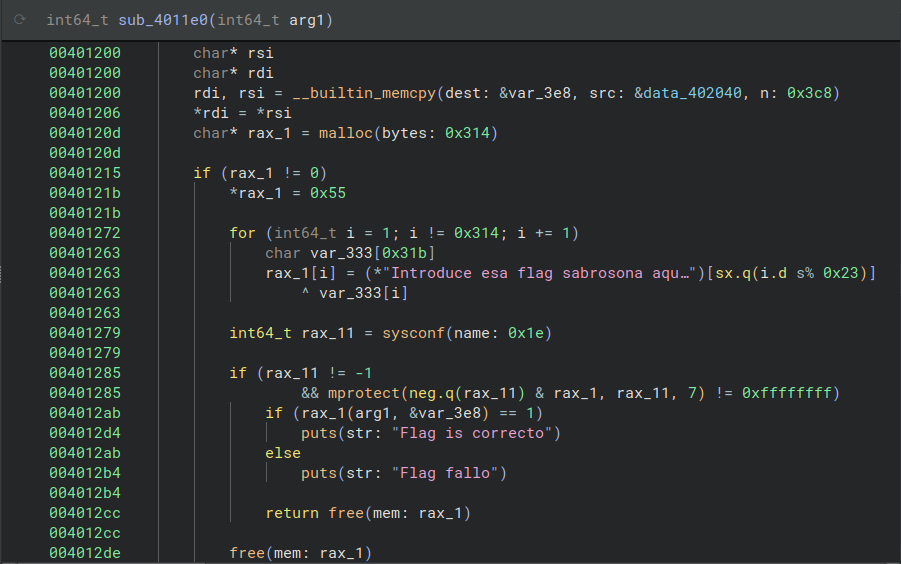
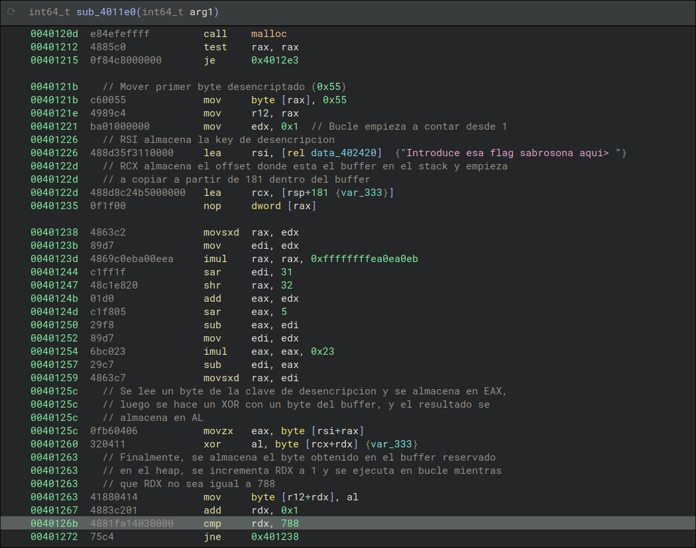
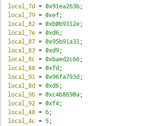
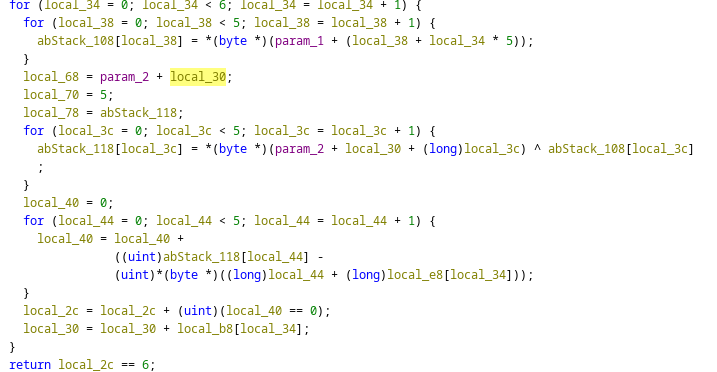
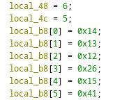

# Dropped It

> Navaja Negra CTF 2025

> 02/10/2025 09:00 CEST - 04/10/2025 11:00 CEST

* Categoría: Reversing
* Autor: nacabaro
* Dificultad: ★★☆
* Etiquetas: Dropper

## Descripción

    Upsi, se me cayó algo, pero no sé qué fue. ¿Me sacas una flag plis?

## Archivos

    chall

```
Binario ELF
```

## Resolución

Se proporciona un binario que solicita la flag. Al introducirla, el programa la valida y muestra si es correcta o no. La dificultad del reto reside en entender el mecanismo de validación, ya que la comprobación final la realiza un binario auxiliar que se genera en tiempo de ejecución.

### Análisis del binario

Al abrir el binario con herramientas como Binary Ninja se observa la solicitud de la flag. Tras esta, se invoca la siguiente función:



En ella se aprecia cómo se modifica una región de memoria aplicando una operación XOR sobre la cadena `Introduce esa flag sabrosona aqui> `. A continuación se llama `mprotect` para marcar esa región como ejecutable y, finalmente, se transfiere la ejecución a dicho código.

### Extracción de la sección de memoria

Los decompiladores suelen permitir extraer la información en distintos formatos, como binario o base64, algo que va a ser muy útil para poder deshacer las operaciones con un script en Python.

#### Obtención del offset

El vector de datos que nos interesa es `data_402040`, que como se puede ver en la función `__builtin_memcpy` tiene una longitud de 968 bytes. Estos datos contienen tanto la función encriptada, como la información necesaria para desencriptar la flag.


Mientras que la función de verificación está encriptada con la operación XOR mencionada anteriormente, la clave no lo está. Por tanto, debemos identificar dónde comienza la función de verificación.

Para ello, observamos detalladamente el código ensamblador.



Se puede observar que el registro `RSP` está apuntando al principio del buffer completo. Mientras tanto `RCX` está apuntando a un offset dentro de este buffer. Seguidamente, podemos observar que las operaciones XOR empiezan desde el byte 181 + 1, ya que `EDX` se usa como incremento y empieza en 1, y `EAX` guarda el primer byte desencriptado (0x55).

### Analizando el binario recuperado

Una vez desencriptado, se puede exportar la función resultante en un fichero separado. Acto seguido, se incorpora en Ghidra para poder analizar su comportamiento.

Este es el código decompilado:





La función utiliza la parte que no se ha desencriptado del buffer `data_402040` (los 181 bytes anteriores), para generar la flag. Estos 181 bytes se dividen en segmentos de tamaño variable que se pueden observar en la función decompilada:



La flag a su vez es dividida igualmente en 6 segmentos de 5 caracteres. A cada uno de ellos se le realiza una operación XOR con su respectivo fragmento del buffer. Finalmente se comprueba que todos los fragmentos son iguales.

Aplicando la operación XOR a los fragmentos de la flag cifrada con los fragmentos del buffer utilizando sus respectivos offsets recuperamos la flag original.

```python
funLength = 181

binary_data = [0x55, 0x48, 0x89, 0xe5, 0x89, 0x7d, 0xfc, 0x89, 0x75, 0xf8, 0x8b, 0x55, 0xfc, 0x8b, 0x45, 0xf8, 0x1, 0xd0, 0x5d, 0xc3, 0x55, 0x48, 0x89, 0xe5, 0x89, 0x7d, 0xfc, 0x89, 0x75, 0xf8, 0x8b, 0x45, 0xfc, 0xf, 0xaf, 0x45, 0xf8, 0x5d, 0xc3, 0x55, 0x48, 0x89, 0xe5, 0x89, 0x7d, 0xfc, 0x89, 0x75, 0xf8, 0x8b, 0x45, 0xfc, 0x2b, 0x45, 0xf8, 0x5d, 0xc3, 0x55, 0x48, 0x89, 0xe5, 0x89, 0x7d, 0xfc, 0x89, 0x75, 0xf8, 0x66, 0xf, 0xef, 0xc0, 0xf2, 0xf, 0x2a, 0x45, 0xfc, 0x66, 0xf, 0xef, 0xc9, 0xf2, 0xf, 0x2a, 0x4d, 0xf8, 0xf2, 0xf, 0x5e, 0xc1, 0xf2, 0xf, 0x5a, 0xc0, 0x5d, 0xc3, 0x55, 0x48, 0x89, 0xe5, 0x89, 0x7d, 0xfc, 0x89, 0x75, 0xf8, 0x8b, 0x45, 0xfc, 0x99, 0xf7, 0x7d, 0xf8, 0x89, 0xd0, 0x5d, 0xc3, 0x55, 0x48, 0x89, 0xe5, 0x89, 0x7d, 0xec, 0xc7, 0x45, 0xfc, 0x0, 0x0, 0x0, 0x0, 0xc7, 0x45, 0xf8, 0x1, 0x0, 0x0, 0x0, 0xc7, 0x45, 0xf4, 0x0, 0x0, 0x0, 0x0, 0xeb, 0x16, 0x8b, 0x45, 0xfc, 0x89, 0x45, 0xf0, 0x8b, 0x45, 0xf8, 0x1, 0x45, 0xfc, 0x8b, 0x45, 0xf0, 0x89, 0x45, 0xf8, 0x83, 0x45, 0xf4, 0x1, 0x8b, 0x45, 0xf4, 0x3b, 0x45, 0xec, 0x7c, 0xe2, 0x8b, 0x45, 0xfc, 0x5d, 0xc3, 0x1c, 0x26, 0xfd, 0x97, 0x2e, 0x31, 0x34, 0x37, 0x36, 0x68, 0xe4, 0x9f, 0xb9, 0x20, 0x66, 0x6c, 0x29, 0xee, 0x9d, 0x6b, 0x9e, 0x9d, 0x8d, 0x27, 0xfa, 0xda, 0x7e, 0x9e, 0xdf, 0x9e, 0x39, 0xfc, 0x89, 0x76, 0xa9, 0x8f, 0xa9, 0x31, 0xf9, 0x54, 0x42, 0x9f, 0xf2, 0xa3, 0x65, 0xea, 0x9c, 0xa6, 0x65, 0xe0, 0x42, 0x50, 0xde, 0x90, 0xb5, 0x24, 0xe8, 0xa4, 0xa8, 0x36, 0xee, 0x5f, 0x7b, 0x99, 0xf4, 0xb7, 0x30, 0xec, 0xe7, 0xe7, 0xcc, 0x12, 0x8b, 0x8d, 0x90, 0x2, 0x59, 0x8e, 0xdf, 0xe6, 0x20, 0xf3, 0x9c, 0xe7, 0xe3, 0x1b, 0x9e, 0x98, 0xdf, 0x4e, 0x18, 0x98, 0xe4, 0xa9, 0xf6, 0x14, 0x91, 0x9e, 0xdf, 0xb7, 0xb6, 0xf0, 0x1b, 0xc1, 0xdf, 0xb6, 0x64, 0x1d, 0xca, 0xab, 0xa2, 0xf0, 0x15, 0x9a, 0xdf, 0x9a, 0x87, 0xa6, 0x65, 0xa6, 0x6a, 0x61, 0x67, 0x20, 0xb4, 0x24, 0xde, 0x77, 0x6f, 0x73, 0x6f, 0xa9, 0xe4, 0x70, 0x9e, 0x8e, 0x8a, 0x7d, 0x3e, 0x20, 0x49, 0xa9, 0xf1, 0x26, 0x90, 0x9b, 0x8a, 0x70, 0x65, 0x20, 0x65, 0xb4, 0xe4, 0x78, 0x99, 0x93, 0x9e, 0x75, 0x20, 0x73, 0x61, 0xa5, 0xf7, 0x33, 0x8c, 0x90, 0x91, 0x47, 0x20, 0x61, 0x71, 0xb2, 0xec, 0x5e, 0xdf, 0xb6, 0x91, 0x61, 0x72, 0x6f, 0x64, 0xb2, 0xe6, 0x1, 0xdf, 0x9a, 0x8c, 0x20, 0x20, 0x66, 0x6c, 0x29, 0xea, 0x65, 0xf8, 0x29, 0xeb, 0xf7, 0x4f, 0x8c, 0x90, 0x91, 0x29, 0xad, 0x24, 0xf7, 0x3d, 0xe0, 0xbb, 0x8, 0xb6, 0x91, 0x8b, 0x3a, 0xe2, 0x21, 0xf4, 0x2b, 0xec, 0xa5, 0x55, 0x8c, 0x9e, 0xdf, 0x2e, 0xe1, 0xe4, 0x1b, 0xdf, 0x8c, 0x9e, 0x2a, 0xfb, 0xea, 0x4b, 0x90, 0x91, 0x9e, 0x68, 0xec, 0xf4, 0x2, 0x96, 0xc1, 0xdf, 0x1, 0xe7, 0xf1, 0x32, 0x90, 0x9b, 0x8a, 0x2b, 0xe8, 0xa5, 0x17, 0x8c, 0x9e, 0xdf, 0x2e, 0xe5, 0xe4, 0x2f, 0xdf, 0x8c, 0x9e, 0xe9, 0x37, 0xd3, 0xf0, 0xaf, 0x6f, 0x29, 0x43, 0xb1, 0x39, 0xf6, 0x83, 0x3f, 0x68, 0xc0, 0x3b, 0xc4, 0x3a, 0xc, 0xb4, 0x3c, 0xea, 0xb1, 0x61, 0xd8, 0x73, 0x61, 0x20, 0x66, 0x24, 0x2, 0xb7, 0x68, 0xfa, 0xb0, 0xd9, 0x72, 0x6f, 0x73, 0x6f, 0x26, 0xf9, 0x9a, 0x71, 0x71, 0x75, 0x69, 0x76, 0xa3, 0xa3, 0x6f, 0x3c, 0x73, 0xbf, 0xdf, 0x65, 0x63, 0x65, 0x20, 0xdf, 0x73, 0x61, 0x20, 0x66, 0x24, 0x96, 0x94, 0x68, 0x18, 0xa1, 0x72, 0x3a, 0x46, 0xb7, 0x27, 0xe7, 0x81, 0x68, 0xe2, 0xb1, 0x75, 0x21, 0xb7, 0x65, 0xe1, 0xa9, 0x31, 0xae, 0x6f, 0x64, 0x75, 0x63, 0xa2, 0x65, 0xbd, 0x73, 0x61, 0x20, 0x66, 0xab, 0x24, 0xb3, 0x20, 0x73, 0x61, 0x62, 0x9b, 0x18, 0x72, 0x6f, 0x6e, 0xa6, 0x65, 0xb1, 0x71, 0x75, 0x69, 0x3e, 0xcb, 0x67, 0xe5, 0x31, 0xa6, 0x60, 0xcb, 0x30, 0xdf, 0xec, 0xe2, 0xee, 0x36, 0xb1, 0x21, 0xb6, 0x24, 0x2, 0xb7, 0x68, 0xf8, 0xe4, 0x7a, 0x8d, 0x90, 0x8c, 0x27, 0x6f, 0xb1, 0x2f, 0xd7, 0x79, 0x3d, 0xe2, 0x6b, 0x88, 0xc2, 0x2b, 0xa4, 0x3a, 0xf7, 0xec, 0x79, 0x61, 0xe6, 0x65, 0xb5, 0x72, 0xea, 0x65, 0xb6, 0x57, 0x24, 0xdb, 0x5c, 0xb9, 0x29, 0xe9, 0x27, 0xc7, 0xf8, 0x2a, 0xd2, 0x29, 0xb8, 0xa7, 0x75, 0x77, 0x69, 0xb5, 0x65, 0x91, 0x26, 0x17, 0xa2, 0x27, 0xef, 0xf0, 0x73, 0x9a, 0xdf, 0x9a, 0x3b, 0x60, 0xf0, 0x2e, 0xe5, 0x24, 0xc7, 0xa3, 0xe, 0xdd, 0x62, 0x7d, 0xeb, 0x89, 0x6f, 0x6e, 0x61, 0x68, 0xe8, 0x91, 0x3d, 0xe0, 0xf9, 0xab, 0xc, 0xd2, 0xf7, 0xb2, 0x6e, 0x2c, 0x16, 0xb3, 0x2d, 0xa3, 0x8f, 0x72, 0x29, 0xa9, 0x33, 0xf4, 0x29, 0x4, 0xf0, 0x3a, 0xe8, 0xb2, 0x33, 0xd6, 0x73, 0x6f, 0x6e, 0x61, 0x68, 0x2, 0xa1, 0x3c, 0xe0, 0xec, 0x61, 0xf2, 0x6e, 0x74, 0x72, 0x6f, 0x2c, 0xed, 0xd9, 0x75, 0x20, 0x65, 0x73, 0x29, 0xa3, 0x8c, 0x6d, 0x29, 0x66, 0xf0, 0xc8, 0x71, 0x62, 0x72, 0x6f, 0xc9, 0x6f, 0x6e, 0x61, 0x20, 0x29, 0x86, 0x86, 0x21, 0x55, 0xe0, 0x59, 0x26, 0x5d, 0xb6, 0x27, 0xed, 0x95, 0x2b, 0xe6, 0xe0, 0x65, 0x3b, 0xe8, 0x65, 0xf6, 0xab, 0x24, 0xab, 0x20, 0x73, 0x61, 0x62, 0x99, 0x5e, 0x3b, 0xe4, 0x3b, 0xc9, 0xab, 0x24, 0xbd, 0x3d, 0xf1, 0x31, 0x96, 0x45, 0x6c, 0xff, 0x37, 0xa3, 0x2c, 0x16, 0xb3, 0x2d, 0xab, 0x20, 0xd3, 0x29, 0x21, 0xb6, 0x63, 0xd7, 0x67, 0x11, 0xbb, 0xe8, 0xa3, 0x3a, 0xe4, 0x26, 0xff, 0xe5, 0x24, 0xec, 0x29, 0xe9, 0xfd, 0x65, 0x3c, 0xa3, 0xc, 0xa2, 0x75, 0xf9, 0x2a, 0xa8, 0x4e, 0x26, 0xd9, 0x5c, 0xa2, 0xb4, 0x24, 0xe8, 0x66, 0x6c, 0x61, 0x67, 0xe7, 0x36, 0xa5, 0x62, 0x72, 0x6f, 0x73, 0x84, 0x5a, 0x29, 0xab, 0x34, 0xe1, 0xfe, 0x2c, 0xfa, 0x68, 0xd1, 0x61, 0xc2, 0x76, 0x6d, 0x6b, 0xc3, 0xb3, 0xee, 0x65, 0xb1, 0x3b, 0xf9, 0x68, 0xed, 0xe0, 0xa4, 0x47, 0xdf, 0x8c, 0x9e, 0xe9, 0x37, 0xab, 0x3b, 0xf7, 0x26, 0x60, 0xe8, 0x6e, 0xc7, 0x75, 0x66, 0x88, 0xe0, 0x60, 0xac, 0x75, 0x27, 0xa7, 0xe7, 0x30, 0xa7, 0x64, 0xab, 0x20, 0xb7, 0x5a, 0x65, 0xda, 0x10, 0xa5, 0xe4, 0x5d, 0xbb, 0x61, 0x6d, 0xe6, 0xaf, 0x7c, 0xd9, 0xae, 0x60, 0x65, 0xbd, 0x39, 0xfc, 0x95, 0xb5, 0x65, 0x9d, 0x26, 0xec, 0xf9, 0xeb, 0xe1, 0x25, 0x9c, 0x9a, 0xdf, 0x64, 0x36, 0xb9, 0xa3, 0x23, 0xb8, 0x60, 0xec, 0x65, 0xa7, 0x5a, 0x27, 0xb2, 0x60, 0xff, 0x12, 0x90, 0x9e, 0xdf, 0xe2, 0xc, 0xa9, 0x6f, 0x31, 0xb4, 0x89, 0x61, 0xc2, 0xb2, 0x27, 0xed, 0x81, 0x2b, 0xe8, 0x45, 0x8d, 0x28, 0x20, 0x7c, 0x27, 0x31, 0x3c, 0xa4 ]
key = "Introduce esa flag sabrosona aqui> "

stop_counter = 0

decrypted_data: bytearray = bytearray()
for i, byte in enumerate(binary_data[funLength:]):
    decrypted_data.append(ord(key[i % len(key)]) ^ byte)
    
print("Escribiendo contenido del dropper en flag_checker.code")

f = open("flag_checker.code", "wb")
f.write(decrypted_data)
f.close()

print("Done!!")

flagEnc1 = [ 0x3b, 0x26, 0xea, 0x91, 0xef ]
flagEnc2 = [ 0x2e, 0x31, 0xb9, 0xb0, 0xd6 ]
flagEnc3 = [ 0x31, 0x1a, 0xb9, 0x95, 0xd9 ]
flagEnc4 = [ 0x66, 0x2c, 0xed, 0xba, 0xfd ]
flagEnc5 = [ 0x3d, 0x79, 0xfa, 0x96, 0xd6 ]
flagEnc6 = [ 0x0a, 0x69, 0xb8, 0xc4, 0xf4 ]

funLengths = [ 20, 19, 18, 38, 21, 65 ]

keys = []
counter = 0

for funcSize in funLengths:
    keys.append(
        binary_data[counter:counter + funcSize]
    )
    counter += funcSize
    
flagFragments = [
    flagEnc1,
    flagEnc2,
    flagEnc3,
    flagEnc4,
    flagEnc5,
    flagEnc6
]
    
flag_res = ""

for i in range(len(flagFragments)):
    for j, byte in enumerate(flagFragments[i]):
        flag_res += chr(keys[i][j] ^ byte)
        
print(flag_res)
```

> **flag: nnctf{y0U_dR0pP3dd_th1ss__!1!}**