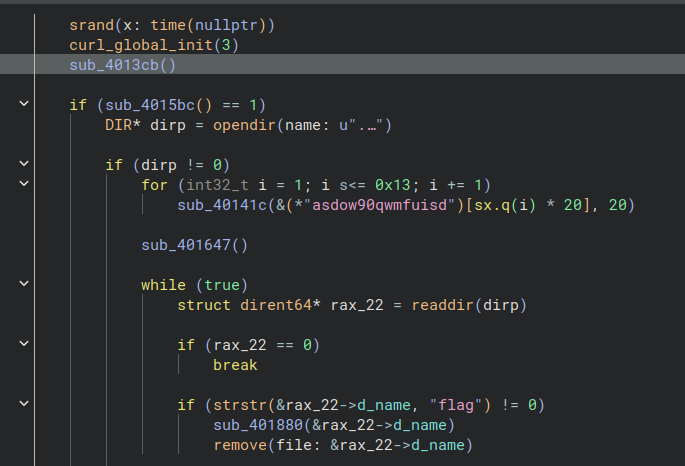
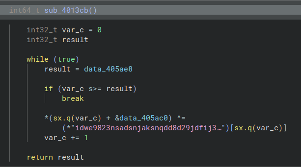
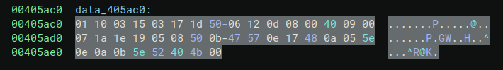
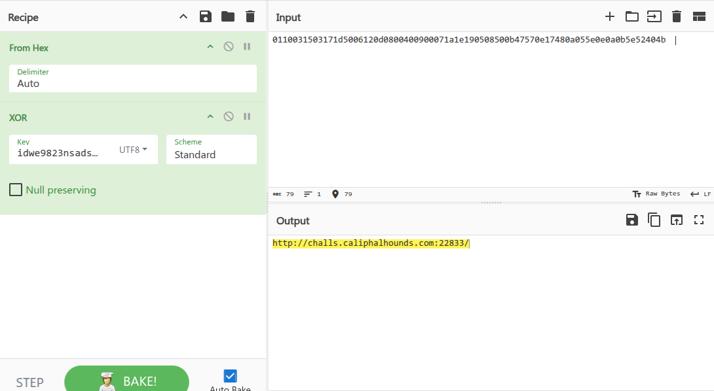
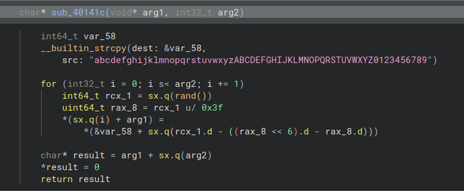
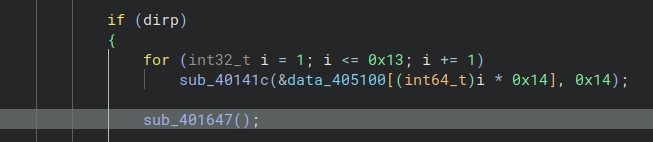
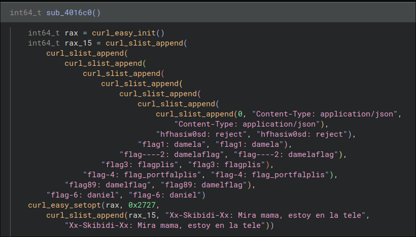
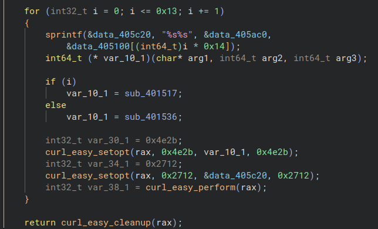
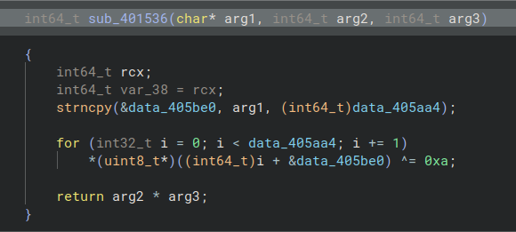

# Flaagcrypt

> Navaja Negra CTF 2025

> 02/10/2025 09:00 CEST - 04/10/2025 11:00 CEST

* Categoría: Reversing
* Autor: nacabaro
* Dificultad: ★★
* Etiquetas: Análisis de malware

## Descripción
    
    He desarrollado mi primer malware, sin embargo, este está diseñado para ser la peor pesadilla de un jugador de CTFs. Flag que vea el malware, flag que se merienda.

    ¿Podrás sacar la flag del malware?

    Nota: Este malware va a intentar encriptar todos los ficheros que tengan la palabra 'flag' en el nombre, en la misma carpeta en la que se encuentra el malware. Se recomienda precaución a la hora de ejecutarlo. No es recursivo buscando ficheros.

## Archivos
    
    flagcrypt

```
Binario ELF
```

## Resolución

En primer lugar procederemos a decompilar el binario empleando herramientas como Binary Ninja. De forma alternativa o complementaria, puede realizarse un análisis dinámico del comportamiento del ejecutable en un entorno virtualizado para observar su comportamiento en tiempo de ejecución.

### Extracción del servidor

El binario establece conexiones a Internet y delega tareas a un servidor remoto. Esto queda evidenciado por llamadas repetidas a la librería curl.

A continuación analizaremos la función señalada:



Observando esta función podemos ver qué hace una operación XOR usando como clave `idwe9823nsadsnjaksnqdd8d29jdfij3489fasdpkwdkoqk2390kasd` y los datos de `data_405ac0`.







### Extracción del endpoint

Actualmente, si accedemos al servidor tal cual, obtenemos un error de página no encontrada. Esto indica que falta alguno de los endpoints esperados o algún parámetro que aún no hemos identificado.

Volviendo al código, analizamos la función encargada de generar los endpoints:



Dicha función acepta dos parámetros, uno de los cuales tiene un valor definido:


Con estos detalles podemos seguir cómo se construyen las peticiones. En la función `sub_401647()` se configuran las cabeceras HTTP y se inician las solicitudes al servidor.







Primero se configuran las cabeceras y, según el valor de un parámetro, se invoca una u otra rutina.

En el caso excepcional cuando `i = 0`:



Los datos obtenidos de la petición se almacenan en un buffer y se someten a una transformación mediante una operación XOR con la constante `0xA`.

### Obtención de la flag

Con lo anterior, procedimos a realizar peticiones al servidor. Una solicitud sin cabeceras a
`https://challs.caliphalhounds.com:22833/asdow90qwmfuisd` devuelve un error 404.

Añadiendo las cabeceras que se ven en el binario, nos devuelve la siguiente:

`ddi~lqF>Uif>|9Uy;9gzXoUoY~_|EEUk{_CCC++;;+;w`

```python
endpoint = "asdow90qwmfuisd"
url = decoded_url + endpoint

user_agent = ""

headers = {
    "Content-Type": "application/json",
    "hfhasiw0sd": "reject",
    "flag1": "damela",
    "flag----2": "damelaflag",
    "flag3": "flagplis",
    "flag-4": "flag_portfalplis",
    "flag89": "damelflag",
    "flag-6": "daniel",
    "xx---flag69---xx": "Mira mama, estoy en la tele",
    "User-Agent": user_agent
}

import requests

resp = requests.get(url, headers=headers)
flag_enc = resp.text
print(flag_enc)
```

Aplicando el XOR con `0xA`:

```python
host_obf = [ 0x1, 0x10, 0x3, 0x15, 0x3, 0x17, 0x1d, 0x50, 0x6, 0x12, 0xd, 0x8, 0x0, 0x40, 0x9, 0x0, 0x7, 0x1a, 0x1e, 0x19, 0x5, 0x8, 0x50, 0xb, 0x47, 0x57, 0xe, 0x17, 0x48, 0xa, 0x5, 0x5e, 0xe, 0xa, 0xb, 0x5e, 0x52, 0x40, 0x4b ]
key = "idwe9823nsadsnjaksnqdd8d29jdfij3489fasdpkwdkoqk2390kasd"

decoded_url = "".join([ chr(url_char ^ ord(key[i])) for i, url_char in enumerate(host_obf) ])

endpoint = "asdow90qwmfuisd"
url = decoded_url + endpoint

print(url)

user_agent = ""

headers = {
    "Content-Type": "application/json",
    "hfhasiw0sd": "reject",
    "flag1": "damela",
    "flag----2": "damelaflag",
    "flag3": "flagplis",
    "flag-4": "flag_portfalplis",
    "flag89": "damelflag",
    "flag-6": "daniel",
    "Xx-Skibidi-Xx": "Mira mama, estoy en la tele",
    "User-Agent": user_agent
}

import requests

url = f'http://localhost:5000/{endpoint}'
resp = requests.get(url, headers=headers)
flag_enc = resp.text
print(flag_enc)

flag_key = 0x0A

decoded_flag = "".join([ chr(ord(char_flag) ^ flag_key) for char_flag in flag_enc ])
print(decoded_flag)
```

> **flag: nnctf{L4_cl4v3_s13mpRe_eStUvOO_aqUIII!!11!1}**